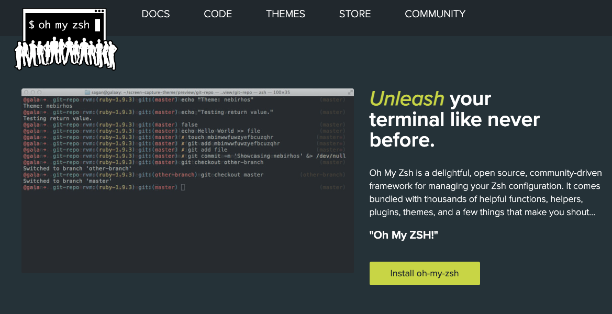
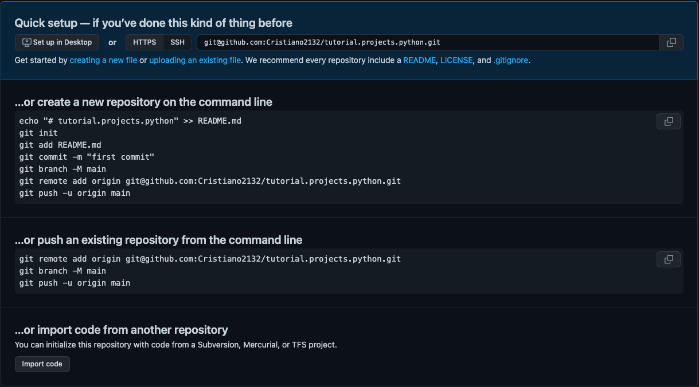

# 1.  Configure o terminal


Se você tem dificuldade em utilizar o terminal do seu computador, utilizar um thema do [ho-my-zsh](https://ohmyz.sh/) pode tornar o isto mais simples. A seguir é descrito como personalizar seu terminal com [ho-my-zsh](https://ohmyz.sh/).


<p align="center">
    
</p>

Instale `oh-my-zsh`


* via `curl`
```bash
sh -c "$(curl -fsSL https://raw.githubusercontent.com/ohmyzsh/ohmyzsh/master/tools/install.sh)"
```


* via `wget`
```bash
 sh -c "$(wget https://raw.githubusercontent.com/ohmyzsh/ohmyzsh/master/tools/install.sh -O -)"
```


Mude o [tema](https://github.com/ohmyzsh/ohmyzsh/wiki/Themes) se desejar:

```bash
cd
code .zshrc
```
* mude o thema para `bira`. Você pode ver a lista de themas disponíveis [aqui](https://github.com/ohmyzsh/ohmyzsh/wiki/Themes).

* reinicie o terminal


# 2 Criando um projeto


Crie repositório no GitHub. Quando finalizar verá uma janela como esta. 

<p align="center">
    
</p>

Será exibida após a criação do repositório no GitHub, as informações e dicas que você precisa. A seguir é indicado duas formas de levar o repositório para sua máquina local.


**Opção 1.** Clonar o repositório
<details>
<summary>Click here for more information!</summary>

Observe que na parte superir da imagem, ao lado de SSH, temos o seguinte endereço `git@github.com:Cristiano2132/tutorial.projects.python.git`. 
    
* Copie este endereço

* Abra o terminal do ceu computador

* Navegue até o diretório onde deseja fazer download do seu repositório. Por padrão o terminal abrirá na pasta raiz do computador, você poderá se guiar até o local desejado utilizando o comando `ls`, este comando exibe o nome de arquivos e pastas do diretório atual. Para navegar para uma pasta listada basta utilizar o comando `cd nome_da_pasta`. 

* Clone a o seu repositório.
```bash
git clone git@github.com:Cristiano2132/tutorial.projects.python.git
```
  
</details>


**Opção 2.** Adicionar repositório remoto a um diretório existente

<details>
<summary>Click here for more information!</summary>

Criar um diretório em sua máquina e então inicializar o git: Para isto basta seguir as instruções que aparecem na imagem em `…or create a new repository on the command line`.
      
```bash
git init
git add README.md
git commit -m "first commit"
git branch -M main
git remote add origin git@github.com:Cristiano2132/tutorial.projects.python.git
git push -u origin main
```
</details>

# 3 Git

Ainda no prompt navegue até a pasta do seu repositório local, então execute:
```bash
code .
```
Este comando irá abrir o VSCode. Crie um novo arquivo em seu diretório chamado `.gitignore`.

Edite o arquivo `.gitignore`. Abra em seu navegador o site `https://www.toptal.com/developers/gitignore`. Use as keywords `Python` e `VisualStudioCode` e clique em create. Copie o conteúdo que irá ser exibido e cole em seu `.gitignore`.

Caso você precise trabalhar com arquivos grandes, csv por exemplo, e deseja mantê-los apenas em seu repositório local, 
você pode fazer isso adicionando-os ao `.gitignore` ou adicionando a 
intrução para ignorar todos os arquivos da respectiva extenção `*.csv`

Execute os comandos a seguir para adicionar, commitar as alterações e para atualizar o repositório remoto. Observe o que é exibido após cada comando utilizando `git status`.

```bash
git status
git add .
git status
git commit -m "<Adicione uma mensagem>"
git status
git push
git status
```

Observe que podemos adicionar uma mensagem em nosso `commit`. Existem alguns [padrões](https://gist.github.com/qoomon/5dfcdf8eec66a051ecd85625518cfd13) que você pode utilizar no início da mensagem que poderão facilitar a identificação do que está sendo adicionado caso no futuro seja necessário procurar por um commit específico.

* `feat` Commits, that adds a new feature

* `fix` Commits, that fixes a bug

* `refactor` Commits, that rewrite/restructure your code, however does not change any behaviour

* `perf` Commits are special `refactor` commits, that improve performance

* `style` Commits, that do not affect the meaning (white-space, formatting, missing semi-colons, etc)

* `test` Commits, that add missing tests or correcting existing tests

* `docs` Commits, that affect documentation only

* `build` Commits, that affect build components like build tool, ci pipeline, dependencies, project version, ...

* `ops` Commits, that affect operational components like infrastructure, deployment, backup, recovery, ...

* `chore` Miscellaneous commits e.g. modifying `.gitignore`

> **Note**
> 📌  Aqui falamos apenas sobre alguns comandos do Git, mas para trabalhar em um projeto com colaboradores utilizando esta ferramenta é fundamental conhecer suas funcionalidades e aprender a usá-las. Segue uma ótima referência para aprender o que você precisa https://learngitbranching.js.org/. Aqui você aprenderá a trabalhar com Git jogando 🎮.

<!-- <p class="webnots_quote">
<em>
📌  Aqui falamos apenas sobre alguns comandos do Git, mas para trabalhar em um projeto com colaboradores utilizando esta ferramenta é fundamental conhecer suas funcionalidades e aprender a usá-las. Segue uma ótima referência para aprender o que você precisa https://learngitbranching.js.org/. Aqui você aprenderá a trabalhar com Git jogando 🎮.
</em>
</p>
<style>
.webnots_quote {
    background: #7FB3D5  none repeat scroll 0 0;
    border-color: #808080;
    border-style: inset;
    border-width: 0px 0px 0px 15px;
    color: #ffffff;
    font-size: 15px;
    padding: 5px;
    font-family: monospace;
}
</style> -->


# 4 Virtual environment


O módulo `venv` suporta a criação de “ambientes virtuais” leves, cada um com seu próprio conjunto independente de pacotes Python instalados em seus sitediretórios. Um ambiente virtual é criado sobre uma instalação existente do Python.

Quando usadas em um ambiente virtual, ferramentas de instalação comuns, como `pip` , instalarão pacotes Python em um ambiente virtual.

Se ainda não têm o módulo virtualenv instalado, faça a instalação.
```bash
pip install virtualenv
```
Para criar o virtual environment basta executar:

```bash
 python<version> -m venv <virtual-environment-name>
```
Por exemplo:
```bash
 python3.10 -m venv .venv
```
Para ver quais versões do python estão instaladas em sua máquina, basta utilizar o seguinte comando:
```bash
where python
```

Agora que você criou o ambiente virtual, precisará ativá-lo antes de poder usá-lo em seu projeto. Para ativar seu ambiente virtual, execute o código abaixo:

```bash
source <virtual-environment-name>/bin/activat
```
Isso ativará seu ambiente virtual. Note que o caminho do seu terminal irá incluir `<virtual-environment-name>`, indicando que seu ambiente virtual está ativado.

Após instalar as bibliotecas que irá utilizar, você pode salvar a lista de bibliotecas instaladas gerando um arquivo de texto contendo todas as dependências do projeto. Para isto execute o código abaixo:

```bash
pip freeze > requirements.txt
```

📝 **Por que criar um arquivo de requirements é importante para o seu projeto?**

Geralemnte quando atualizamos nosso repositório remoto do GitHub a pasta do nosso virtual environment não é enviada, pois a adicionamos ao `gitignore`. Assim em um projeto com colaboradores, o arquivo `requirements.txt` permitirá que o colaborador instale as dependências do projeto em um virtual environment facilmente.

Para recriar o seu ambiente de desenvolvimento, basta seguir os passos acima para criação e ativação do ambiente virtual e então executar:

```
pip install -r requirements.txt
````


> **Warning**
> Lembre-se de atualizar o arquivo de requirements quando instalar novas dependências. 


<!--  -->

